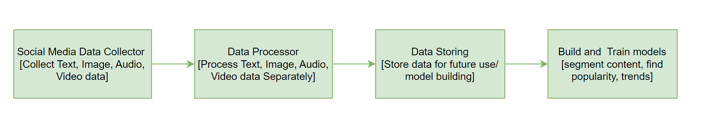

# Prolem 1: Build Social Media Agent 

## Problem Breakdown

1. Social Media contents can vary in different form [Image, Text, Audio, Video], therefore we need to collect each type of data and process and build model for each of them
2. Some social content will fall under one or more of them, even some content will fall into all four of them
3. even sometimes some content will have corner case like an Image containing both Scene and Text.

## Probable Solution

To approach this problem I will break the whole problem into 4 stages and Implement each stage individually independent. The solution can be visualized below,




As the process flow suggests, those 4 stages can be named as:
```
1. Data Collector
2. Data Processor
3. Data Storing
4. Build and Train Models
```
Here is a brief explanation of each stage for further clarification

## Data collector
First we need data to have a proper understand of what we are going to do and how we are going to do. This stage can be further broken down into,
```
i) Extract data using some web crawler
ii) Sort individual type of data [Image, Text, Audio, Video]
```
## Data Processor
After data collection is complete, we can now move to data process stage. Raw data is not ready to use and also, there are lots of unwanted thing in raw data which should be taken care of according to our interest.
```
i) Process text data and clean it
ii) Process Image data 
iii) Process Audio data
iv) Process Video data
v) These data can be interconnected as all those can be in a single content, we need to keep track of it
vi) We have to build model keeping in mind of these interconnection and their process flow
```
## Data Storing
After processing the data we need to store it for further useage like model building or even can be kept for future usage
```
i) Store the data in structured way
ii) Store the interconnection of the data
```
## Build and Train Models
We need to build model keeping data pattern and our goal in mind. As we have 4 types of data we will have to build at least 4 models.
```
i) Build at least 4 models [for Text, Image, Audio, Video]
ii) We may need to build more type of model keeping our goal in mind
iii) We may even need to build models using interrelation of of our data or using the data flow pattern
iv) Combining each model to perform our required task